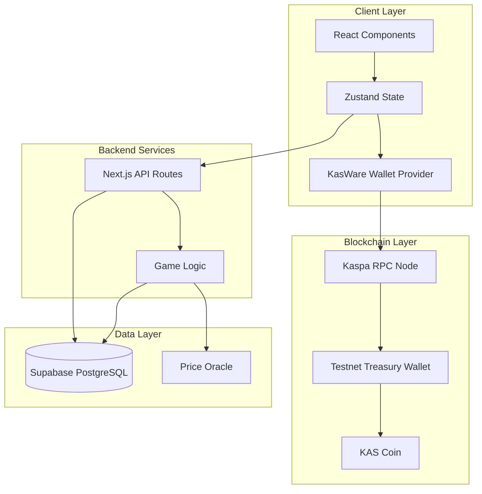

# KASNOMO - Kaspa BlockDAG Price Prediction Game

KASNOMO is a high-speed real-time BlockDAG price prediction game built on the Kaspa Network. Users deposit KAS coins to their house balance and place bets on Kaspa price movements within 30-second rounds. The system leverages the incredible speed of Kaspa's BlockDAG for near-instant confirmations and combines it with a secure off-chain betting engine for optimal user experience.

## Core Features

- **Ultra-Fast Betting**: 30-second prediction rounds
- **Kaspa Integration**: Native KAS betting on Kaspa Testnet 10
- **KasWare Wallet**: Seamless connection with the leading Kaspa wallet
- **Performance**: Zero-latency betting using off-chain house balance system
- **Real-Time Data**: Live Candlestick charts and targets
- **Secure Treasury**: On-chain verified deposits and withdrawals
- **Provably Fair**: Audit logging for all balance operations

## System Architecture

The application uses a hybrid architecture involving on-chain treasury operations on the Kaspa Network and a high-performance off-chain game engine.

### High-Level Flow



## Technical Stack

### Frontend
- **Next.js 14**: React framework with App Router
- **TypeScript**: Strictly typed codebase
- **Tailwind CSS**: Modern utility-first styling
- **Zustand**: Global state management
- **KasWare Wallet API**: Native integration for Kaspa wallet

### Blockchain
- **Kaspa Network**: The world's fastest BlockDAG (Testnet 10)
- **KasWare**: Browser extension wallet
- **KAS**: Native currency for all operations

### Backend
- **Next.js API Routes**: Serverless functions
- **Supabase**: PostgreSQL database with Row Level Security
- **RPC**: Direct connection to Kaspa public nodes

## Prerequisites

- Node.js 18+ and npm
- **KasWare Wallet** browser extension ([Download Here](https://www.kasware.xyz/))
- Kaspa Testnet (TN10) KAS coins (Get from the [Kaspa Faucet](https://faucet.kaspanet.io/))

## Getting Started

### 1. Install Dependencies

```bash
npm install
```

### 2. Configure Environment

Copy the example or create a new `.env` file:

```bash
NEXT_PUBLIC_KASPA_NETWORK=testnet-10
NEXT_PUBLIC_KASPA_RPC_ENDPOINT=https://api.kaspa.org/testnet10

# Supabase Credentials
NEXT_PUBLIC_SUPABASE_URL=your_supabase_url
NEXT_PUBLIC_SUPABASE_ANON_KEY=your_anon_key
SUPABASE_SERVICE_ROLE_KEY=your_service_role_key

# Kaspa Treasury (For deposits/withdrawals)
NEXT_PUBLIC_KASPA_TREASURY_ADDRESS=kaspatest:qz...
KASPA_TREASURY_PRIVATE_KEY=your_private_key
```

### 3. Database Setup

Run the SQL migrations found in `supabase/migrations/` in your Supabase SQL Editor to set up:
- `user_balances`
- `bet_history`
- `balance_audit_log`
- `kaspa_bet_history` (New)

### 4. Run the App

```bash
npm run dev
```

Open [http://localhost:3000](http://localhost:3000) in your browser.

## Database Schema

### user_kaspa_balances
Tracks the off-chain "House Balance" for users.

| Column | Type | Description |
|--------|------|-------------|
| user_address | TEXT | Kaspa wallet address (kaspatest:...) |
| balance | NUMERIC | Current KAS balance |
| updated_at | TIMESTAMP | Last interaction |

### kaspa_bet_history
Immutable record of all bets placed.

| Column | Type | Description |
|--------|------|-------------|
| id | UUID | Unique bet ID |
| wallet_address | TEXT | User's Kaspa address |
| amount | NUMERIC | Bet amount in KAS |
| direction | TEXT | UP or DOWN |
| won | BOOLEAN | Outcome of the round |

## Troubleshooting

### Wallet Not Connecting
- Ensure **KasWare Wallet** is installed and unlocked.
- Switch the network in KasWare to **Testnet 10**.

### "Insufficient Funds"
- Request testnet KAS from the [faucet](https://faucet.kaspanet.io/).
- Ensure you have deposited funds into the house balance via the Wallet tab.

## License

MIT License

## Resources

- [Kaspa Documentation](https://kaspa.org/documentation)
- [KasWare Wallet Docs](https://docs.kasware.xyz/)
