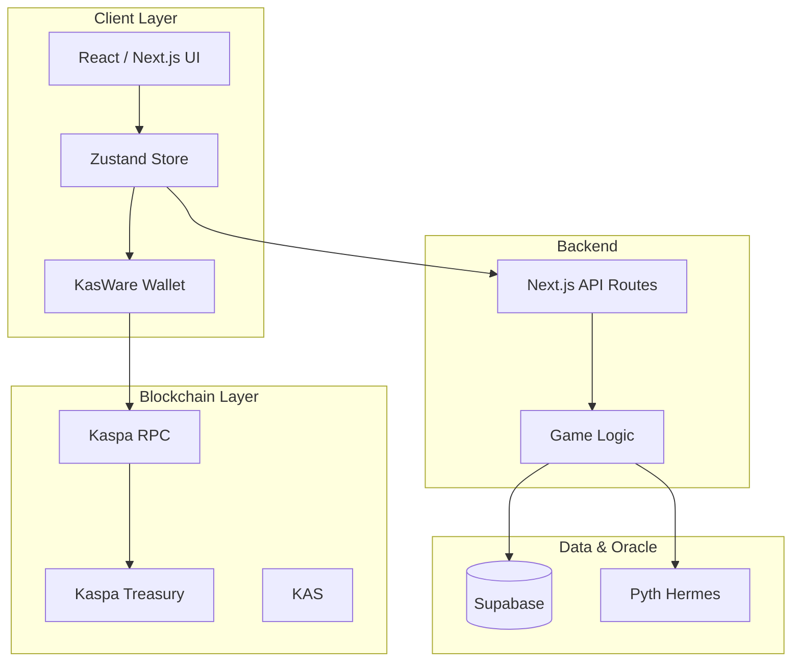
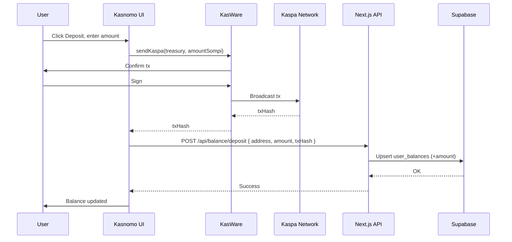
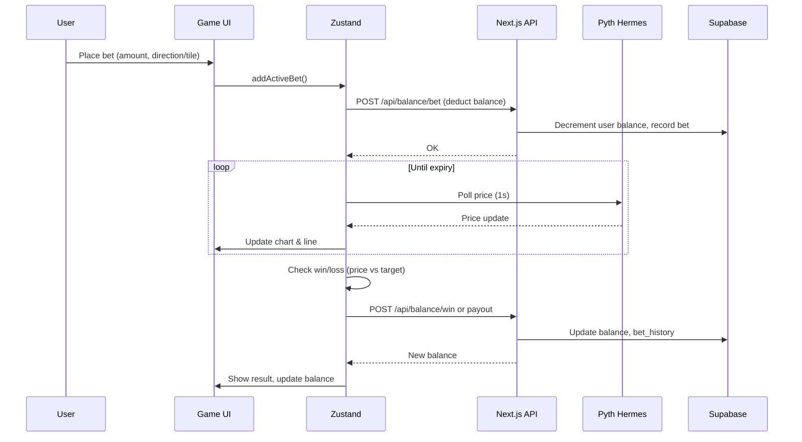
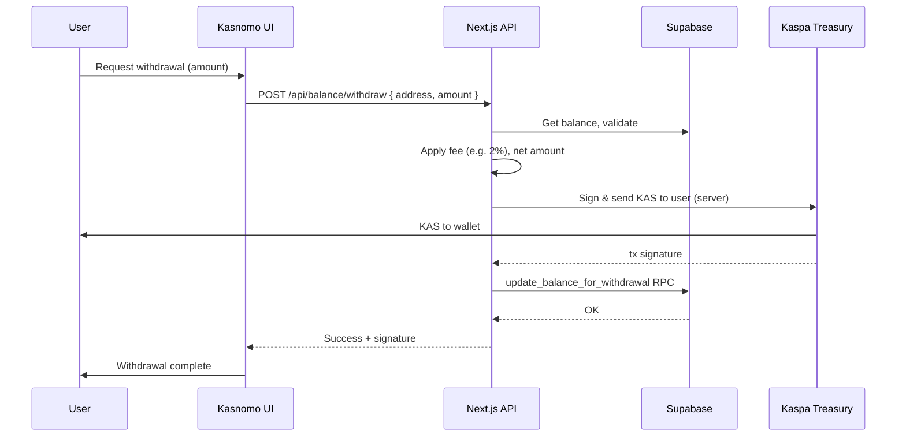

# ☂️ Kasnomo

**The first on-chain binary options trading dApp on Kaspa.**

Powered by **Kaspa** + **Pyth Hermes** price attestations + **Off-chain state (Supabase)** + **x402-style payments**.

Simply put: *Trade binary options with oracle-bound resolution and minimal trust.*

**Built for Kaspa** — demonstrating what becomes possible when block times are measured in milliseconds instead of minutes.

---

## Why Kasnomo?

Binary options trading in Web3 barely exists. In Web2, it’s often broken, fraudulent, and algorithmically biased. Why?

- **No sub-second oracles.** Real-time, sub-second data oracles didn’t exist. One news event, one big move, one crash — oracles lag or break.
- **590M+ crypto users**, **400M+ transactions per day**, and a huge demand for fast, fair prediction products with no equivalent infrastructure.

**Solution: Kasnomo.** Every tick is backed by Pyth oracles. You trade on real-time charts, bet without signing every transaction, and settle in milliseconds — showing what’s possible when block times are measured in milliseconds instead of minutes.

---

## What You Get

- **Real-time resolution** — Pyth Hermes drives millisecond-level price attestations.
- **20+ markets** — Crypto (BTC, ETH, KAS, SOL, …), stocks (AAPL, NVDA, TSLA), metals (Gold, Silver), forex (EUR, GBP, JPY).
- **Bet without signing every txn** — Off-chain house balance (Supabase); deposit/withdraw on Kaspa when you choose.
- **Two modes** — **Classic**: UP/DOWN + expiry (5s, 10s, 15s, 30s, 1m). **Box**: Tap tiles with multipliers; win when the price line touches your tile.
- **1–10x multipliers** (and Blitz for higher risk/reward), no per-round tx cap, single treasury.
- **Settlement in &lt;1ms** — Off-chain engine + oracle-bound resolution.

Like a Web2 “Binomo” experience, but on-chain, oracle-backed, and built for Kaspa’s speed.

---

## How It Works (5 Steps)

1. **Connect & fund** — Land on Kasnomo, connect **KasWare Wallet**, and add KAS from KasWare into your Kasnomo (house) balance.
2. **Choose mode & place bet** — Click Bet, choose amount, then **Classic** (UP/DOWN + expiry) or **Box** (tap multiplier tiles on the chart).
3. **Classic vs Box**  
   - **Classic:** Pick direction (UP/DOWN) and expiry (e.g. 5s, 10s, 15s, 30s, 1m).  
   - **Box:** Tap a tile; if the live price line touches that tile before the round ends, you win at that tile’s multiplier.
4. **Settlement** — Pyth-backed price determines win/loss. Your house balance updates immediately (additions/ deductions).
5. **Withdraw** — On withdrawal, funds are sent from the Kaspa treasury to your wallet (profit case: payout; loss case: net refund).

---

## System Architecture

Hybrid design: **on-chain treasury (Kaspa)** + **off-chain game engine + oracle (Pyth)** + **off-chain state (Supabase)**.

### High-level system view



### Deposit flow (sequence)



### Bet lifecycle (sequence)



### Withdrawal flow (sequence)




- **Kaspa** — Deposits, withdrawals, single treasury; native KAS.
- **Pyth Hermes** — Real-time price attestations for resolution (crypto, stocks, FX, metals).
- **Supabase** — House balances, bet history, audit trail (off-chain state).
- **x402-style** — Payment proof / verification pattern for deposit flows (conceptually aligned with pay-for-data; treasury credits on verified deposit).

---

## Tech Stack

| Layer      | Stack |
|-----------|--------|
| **Frontend** | Next.js 16 (App Router), React 19, TypeScript, Tailwind CSS, Zustand, Framer Motion |
| **Blockchain** | Kaspa Network (Testnet 10), KasWare Wallet, KAS |
| **Oracle** | Pyth Network (Hermes API) — 20+ feeds |
| **Backend** | Next.js API Routes, Supabase (PostgreSQL, RLS) |
| **Payments** | Kaspa treasury (on-chain), x402-style verification pattern |

---

## Market Opportunity

- **TAM (binary / prediction):** ~$27.56B (2025) → ~$116B by 2034 (CAGR ~19.8%).
- **Crypto prediction:** $45B+ annual volume (e.g. Polymarket, Kalshi, on-chain).
- **Crypto derivatives:** $86T+ annual volume (2025).
- **Users:** 590M+ crypto users worldwide.

**Goal:** Become the go-to PolyMarket-style venue for binary options — fast, real, simple.

---

## Roadmap & Future

- Expand markets: more stocks, forex, indices.
- Options, derivatives, futures, and eventually DEX integration.
- **Ultimate objective:** The default PolyMarket for binary options on Kaspa and beyond.

---

## Competitive Edge

We deliver what others can’t:

- **Fast** — Sub-second oracles + off-chain execution; no per-bet on-chain tx.
- **Real** — Pyth attestations; resolution is oracle-bound, not opaque or synthetic.
- **Simple** — One treasury, one wallet (KasWare), clear Classic vs Box UX.

---

## Competitive Landscape

| | **Kasnomo** | **Web2 binary options** (Binomo, IQ Option, etc.) | **Web3 prediction** (Polymarket, Kalshi) | **Other on-chain binary / derivatives** |
|--|-------------|---------------------------------------------------|-----------------------------------------|----------------------------------------|
| **Real-time oracle** | ✅ Pyth Hermes (sub-second) | ❌ Opaque / synthetic feeds | ⚠️ Event-based or delayed | ❌ Often none or slow oracles |
| **Settlement speed** | &lt;1 ms (off-chain engine) | Variable, often disputed | Days (resolution windows) | Block-time bound (minutes) |
| **Trust / provability** | Oracle-bound, audit log | ❌ Opaque, regulatory issues | ✅ On-chain or attested | ⚠️ Varies |
| **Binary options focus** | ✅ Native (Classic + Box) | ✅ Yes | ❌ Mostly yes/no markets | ⚠️ Rare, often full options |
| **Deposit/withdraw** | Kaspa (instant confirmations) | Fiat, KYC | Crypto / fiat, often slow | On-chain, chain speed |
| **Per-bet signing** | ❌ No (house balance) | ❌ No | ⚠️ Often yes | ✅ Typically every tx |
| **Multi-asset (crypto, stocks, FX)** | ✅ 20+ via Pyth | ✅ Yes | ⚠️ Limited | ⚠️ Usually crypto only |
| **Chain** | Kaspa (ms block times) | N/A | Various | ETH, L2s, etc. |

*Kasnomo combines real-time oracle resolution (Pyth), instant-chain treasury (Kaspa), and off-chain execution so users get Web2-like speed with Web3 transparency and no per-bet transactions.*

---

## Kaspa alignment

### Thematic fit: “Build at Internet Speed”

- **Block times in milliseconds** — Kasnomo uses Kaspa’s speed for treasury operations; users deposit/withdraw KAS with instant confirmations instead of waiting for slow chains.
- **Real-time reactivity** — Pyth Hermes + off-chain engine give sub-second price resolution and settlement; the app is built for “internet speed” UX.

### Category tracks

- **Real-Time Data** — Applications leveraging Kaspa’s reactivity: real-time price attestations (Pyth) drive round resolution; Kaspa anchors value flow (deposits/withdrawals).
- **Gaming & Interactive** — Interactive binary options experience where each round is driven by live data and balances update in real time.

## Prerequisites

- **Node.js 18+** and npm (or yarn)
- **KasWare Wallet** ([Download](https://www.kasware.xyz/))
- **Kaspa Testnet (TN10)** KAS — e.g. [Kaspa Faucet](https://faucet.kaspanet.io/)

---

## Getting Started

### 1. Install

```bash
npm install
```

### 2. Environment

Create `.env` from `.env.example`. Required:

```bash
# Supabase (from Supabase dashboard → Settings → API)
NEXT_PUBLIC_SUPABASE_URL=https://your-project.supabase.co
NEXT_PUBLIC_SUPABASE_ANON_KEY=your-anon-key
SUPABASE_SERVICE_ROLE_KEY=your-service-role-key

# Kaspa
NEXT_PUBLIC_KASPA_NETWORK=testnet-10
NEXT_PUBLIC_KASPA_RPC_ENDPOINT=wss://api.kaspa.org/testnet10/wrpc
NEXT_PUBLIC_KASPA_TREASURY_ADDRESS=kaspatest:qz...
KASPA_TREASURY_PRIVATE_KEY=your-treasury-private-key
```

Optional: `EVM_WALLET_ADDRESS`, `EVM_PRIVATE_KEY` for backup wallet; BNB vars if you need BNB withdrawals.

### 3. Database

Run the SQL in `supabase/migrations/` in the Supabase SQL Editor (in order):

- `001_create_user_balances.sql`
- `002_*.sql`, `003_*.sql`, `004_*.sql`

This sets up `user_balances`, `user_kaspa_balances`, `kaspa_bet_history`, audit logs, and procedures.

### 4. Run

```bash
npm run dev
```

Open [http://localhost:3000](http://localhost:3000).

---

## Database (Summary)

- **user_kaspa_balances** — House balance per Kaspa address (KAS).
- **kaspa_bet_history** — Immutable bet log: wallet, asset, direction, amount, multiplier, payout, won, mode, resolved_at.

---

## Troubleshooting

- **Wallet not connecting** — Install/unlock KasWare; set network to **Testnet 10**.
- **Insufficient funds** — Use the [faucet](https://faucet.kaspanet.io/) for testnet KAS; deposit into the house balance via the Wallet tab.

---

## Resources

- [Kaspa](https://kaspa.org/documentation)
- [KasWare](https://docs.kasware.xyz/)
- [Pyth Network](https://pyth.network/)
